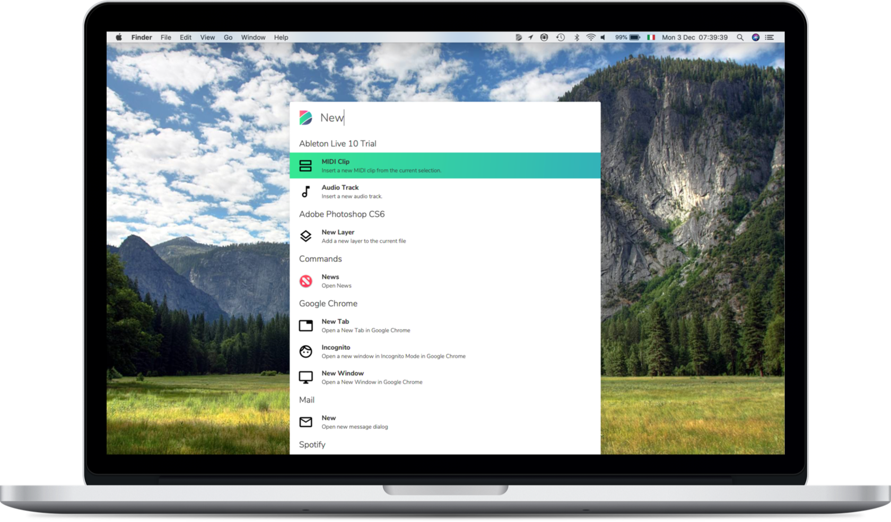

<html lang="en">

<head>
    <link href="web/vendor/bootstrap/css/bootstrap.min.css" rel="stylesheet">
    <link rel="stylesheet" href="web/vendor/font-awesome/css/font-awesome.min.css">
    <link href="https://fonts.googleapis.com/css?family=Nunito+Sans:600,700" rel="stylesheet">
    <link rel="stylesheet" href="web/vendor/feather/feather.css">
    <link href="web/css/build.css" rel="stylesheet">
</head>

<body id="page-top">
    <!-- Masthead -->
    <header class="masthead h-100" id="home">
        <!-- Navigation -->
        <nav class="bg_grad_1 navbar navbar-expand-lg navbar-light" id="mainNav">
            

                <a class="navbar-brand js-scroll-trigger" href="#page-top"> Dokey</a>
                <button class="navbar-toggler navbar-toggler-right" type="button" data-toggle="collapse"
                        data-target="#navbarResponsive" aria-controls="navbarResponsive" aria-expanded="false"
                        aria-label="Toggle navigation">Menu
                    <i class="fa fa-bars"></i>
                </button>
                

                    <ul class="navbar-nav ml-auto">
                        <li class="nav-item">
                            
                        </li>
                        <li class="nav-item">
                            
                        </li>
                        <li class="nav-item">
                            
                        </li>
                    </ul>
                

            

        </nav>
        

            

                <h1>Supercharge</h1>
                <h1 class="mt-1">your productivity</h1>
                <h2 class="mt-3 col-md-8 col-10"></h2>
                

                

            

        

        

            

                

                    
                    
                    
                    

                        Available for Windows, macOS and Android
                    

                

            

        

    </header>
    <iframe class="embed-responsive-item youtube-video"
                            src="https://www.youtube-nocookie.com/embed/EQjjOt5CJX8?enablejsapi=1"
                            frameborder="0" allow="accelerometer; autoplay; encrypted-media; gyroscope; picture-in-picture" allowfullscreen></iframe>            
    <!-- Feature - Dokey App -->
    <section class="features">
        

            

                <h2>Dokey App</h2>
                
Discover a new way to interact with your computer

                

            

            

                

                    
                

                

                    

                        

                            

                                

                                    <i class="fe fe-grid accent-1"></i>
                                    <h3>Control</h3>
                                    
Turn your smartphone into the ultimate control panel for your apps

                                

                            

                            

                                

                                    <i class="fe fe-layers accent-1"></i>
                                    <h3>Ready</h3>
                                    
Dokey provides ready to use built-in panels for the most famous applications

                                

                            

                        

                        

                            

                                

                                    <i class="fe fe-music accent-1"></i>
                                    <h3>Media</h3>
                                    
Control iTunes, Spotify and all your favourite media players

                                

                            

                            

                                

                                    <i class="fe fe-power accent-1"></i>
                                    <h3>System</h3>
                                    
Shutdown, Restart and Lock your computer with a single tap

                                

                            

                        

                    

                

            

        

    </section>
    <!-- Feature - Dokey Dekstop -->
    <section class="features">
        

            

                <h2>Dokey Desktop</h2>
                
Customize your Dokey experience

                

            

            

                

                    

                        

                            

                                

                                    <i class="fe fe-edit accent-2"></i>
                                    <h3>Edit</h3>
                                    
Customize all the panels and even create of your own

                                

                            

                            

                                

                                    <i class="fe fe-share-2 accent-2"></i>
                                    <h3>Share</h3>
                                    
Share your panels with everyone and become the next workflow guru

                                

                            

                        

                        

                            

                                

                                    <i class="fe fe-cast accent-2"></i>
                                    <h3>Sync</h3>
                                    
Keep your panels real-time synced across your devices

                                

                            

                            

                                

                                    <i class="fe fe-send accent-2"></i>
                                    <h3>Transfer</h3>
                                    
(coming soon) Sharing files between your devices, made easy

                                

                            

                        

                    

                

                

                    
                

            

        

    </section>
    <!-- Feature - Dokey Search -->
    <section class="features">
        

            

                <h2>Dokey Search</h2>
                
The power of Dokey at your fingers

                

            

            

                

                    

                        

                            

                                

                                    <i class="fe fe-cpu accent-3"></i>
                                    <h3>Powerful</h3>
                                    
Execute a command, launch an App, search on Google and much more

                                

                            

                            

                                

                                    <i class="fe fe-fast-forward accent-3"></i>
                                    <h3>Fast</h3>
                                    
Quick-command aliases for your favourite actions to speed-up common tasks

                                

                            

                            

                                

                                    <i class="fe fe-box accent-3"></i>
                                    <h3>Integrated</h3>
                                    
Dokey Search works flawlessly with all your favourite apps

                                

                            

                        

                        

                            

                                
                            

                        

                    

                

            

        

    </section>
    

    

</body>
</html>
