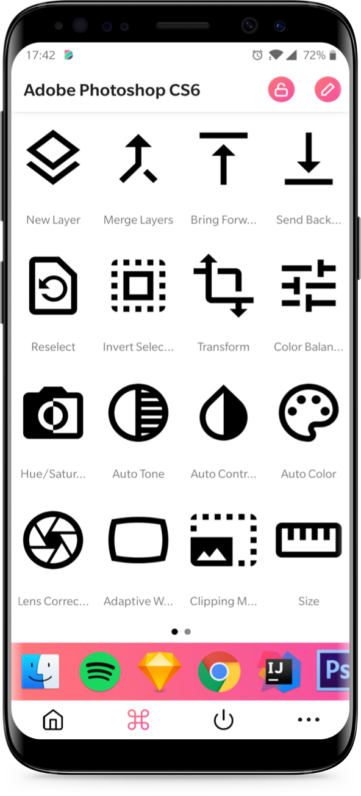
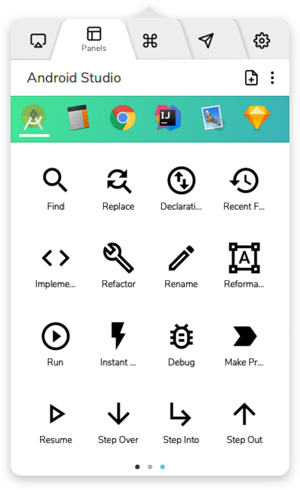

# Dokey
#### Smarter workflow for any software

> **_This project is no longer maintained_**

Dokey is a cross-platform (macOS, Windows, Android) productivity application.
Dokey App turns any smartphone or tablet into an advanced controller for every software.

## Features

### Dokey App
- **Control:** Turn your smartphone into the ultimate control panel for your apps
- **Ready:** Dokey provides ready to use built-in panels for the most famous applications
- **Media:** Control iTunes, Spotify and all your favourite media players
- **System:** Shutdown, Restart and Lock your computer with a single tap

### Dokey Desktop

- **Edit:** Customize all the panels and even create of your own
- **Share:** Share your panels with everyone and become the next workflow guru
- **Sync:** Keep your panels real-time synced across your devices

### Dokey Search
- **Powerful:** Execute a command, launch an App, search on Google and much more
- **Fast:** Quick-command aliases for your favourite actions to speed-up common tasks
- **Integrated:** Dokey Search works flawlessly with all your favourite apps

## Try it out
Dokey is no longer maintained nor distributed. If you want to try it out you can run it in a development environment:

1. Download the [apk](https://github.com/arabello/dokey-android/releases/download/v0.2.0-beta/dokey-v0.2.0-beta.apk) on your Android phone from the [releases page](https://github.com/arabello/dokey-android/releases) and install it
    1. Alternatively, clone this repository, open it with Android Studio or Intellij IDEA and run it on your phone
2. Visit the Dokey Desktop [repository](https://github.com/federico-terzi/remotekey-desktop) and follow the instructions to get it running
3. Open the Dokey App and scan the QR Code displayed by the Dokey Desktop window
